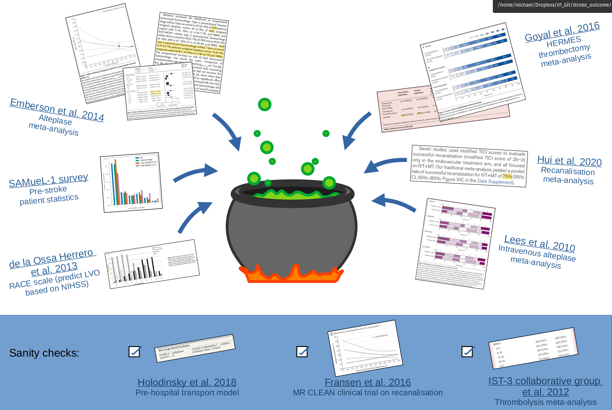
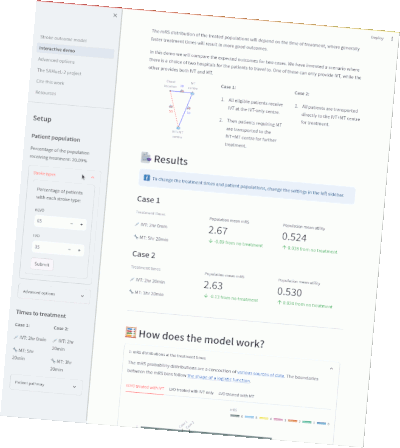
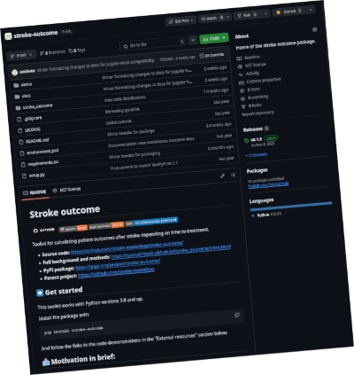

# Introduction

[![GitHub Badge][github-img]][github-link] [![Jupyter Book Badge][jupyterbooks-img]][jupyterbooks-link] [![PyPI][pypi-img]][pypi-link] [![DOI][doi-img]][doi-link] [![Open in Streamlit][streamlit-img]][streamlit-link]

[github-img]: https://img.shields.io/badge/github-%23121011.svg?style=for-the-badge&logo=github&logoColor=white
[github-link]: https://github.com/stroke-modelling/stroke-outcome/
[github-bookrepo-link]: https://github.com/samuel-book/stroke_outcome

[pypi-img]: https://img.shields.io/pypi/v/stroke-outcome?label=pypi%20package
[pypi-link]: https://pypi.org/project/stroke-outcome/

[doi-img]: https://zenodo.org/badge/673336639.svg
[doi-link]: https://zenodo.org/badge/latestdoi/673336639

[jupyterbooks-img]: https://jupyterbook.org/badge.svg
[jupyterbooks-link]: https://samuel-book.github.io/stroke_outcome/intro.html

[streamlit-img]: https://static.streamlit.io/badges/streamlit_badge_black_white.svg
[streamlit-link]: https://samuel2-stroke-outcome.streamlit.app/

# Predicting disability outcomes and utility after treatment of stroke with thrombolysis (IVT) or thrombectomy (MT)

This online Jupyter book describes the methodology for estimating disability outcomes and utility for stroke patients.

The outcomes depend on:
+ the type of stroke.
+ the type of treatment, where different types of strokes may be treated in different ways.
+ the time to treatment, where earlier treatment tends to give better outcomes.

Until now, modelling the outcome from stroke reperfusion treatment was a dichotomous affair, with a patient classified as either being disability free, or with stroke related disabilities. The method described here aims to provide a more granular disability outcome, describing the resulting disability as one of six levels (ranging from disability free, to death).

## A basic overview

More details and definitions are given in the Details pages. There are links to these pages in the left sidebar.
+ Definitions for stroke - stroke types, treatment types, effects of time...
+ Definitions for maths - probability, odds, log-odds...

### Which patients can be modelled?

The methodology described here is for patients with an _ischaemic_ stroke.
Ischaemic stroke is a stroke caused by the blockage of blood supply to an area of the brain, caused by a clot.

These patients can be further defined by the location of the clot:
+ those with a large vessel occlusion (__LVO__);
+ and those not with a large vessel occlusion (__nLVO__).

Ischaemic strokes account for 80-85% of all strokes, with the remainder being *haemorrhagic* strokes where loss of blood supply is caused by a bleed in the brain.

### Which treatments are available?

*Reperfusion* describes the restoration of blood flow following an ischaemic stroke. There are two potential reperfusion treatments:

* *Thrombolysis* (also known as as *intravenous thrombolysis*, __IVT__) is a medical therapy where *clot-busting* drugs are used to reduce or remove the blood clot. About 20% of all stroke patients are suitable for thrombolysis. 

* *Thrombectomy* (also known as *mechanical thrombectomy*, __MT__) is the physical removal of a clot, by a mesh device under image guidance. Thrombectomy is suitable only for clots in a large vessel (these generally cause the worst strokes), and is a suitable treatment in about 10% of all stroke patients.

Patients with an nLVO can be treated with IVT.

Patients with an LVO can be treated with IVT and/or MT.

### Why does the treatment time matter?

Reperfusion treatment becomes less effective with increasing time after stroke (with the loss of effect occurring over some hours). Each treatment has no effect after a specified duration (6.3 hours for IVT, and 8 hours for MT).

In other words, the sooner a patient recieves reperfusion treatment, the fewer stroke related disabilities they could end up with.

### What are these outcomes?

Disability levels may be measured in various ways. In this project we are using the modified Rankin Scale (mRS). It is a commonly used scale for measuring the degree of disability or dependence in the daily activities of people who have suffered a stroke or other causes of neurological disability [Saver *et al*., 2010].

The scale runs from 0-6, running from perfect health without symptoms to death:

| Score | Description                                                                                                            |
|-------|------------------------------------------------------------------------------------------------------------------------|
| 0     | No symptoms.                                                                                                           |
| 1     | No significant disability. Able to carry out all usual activities, despite some symptoms.                              |
| 2     | Slight disability. Able to look after own affairs without assistance, but unable to carry out all previous activities. |
| 3     | Moderate disability. Requires some help, but able to walk unassisted.                                                  |
| 4     | Moderately severe disability. Unable to attend to own bodily needs without assistance, and unable to walk unassisted.  |
| 5     | Severe disability. Requires constant nursing care and attention, bedridden, incontinent.                               |
| 6     | Dead.                                                                                                                  |

Note: From this point onwards we will refer to disability distributions as mRS distributions.

In addition to mRS, we may calculate utility-weighted mRS (UW-mRS). UW-mRS incorporates both treatment effect and patient perceived quality of life as a single outcome measure for stroke trials.

The default utility scores used in the model are based on a pooled analysis of 20,000+ patients, from Wang et al (2020). The Utilities for each mRS level are shown below.

| mRS Score | 0    | 1    | 2    | 3    | 4    | 5     | 6    |
|-----------|------|------|------|------|------|-------|------|
| Utility   | 0.97 | 0.88 | 0.74 | 0.55 | 0.20 | -0.19 | 0.00 |

### What do these models calculate?

This method calculates disability outcome distribution estimates for three patient-treatment cohorts:
1) nLVO-IVT (patients with an nLVO that are treated with IVT)
2) LVO-IVT (patients with an LVO that are treated with IVT)
3) LVO-MT (patients with an LVO that are treated with MT).

For each patient-treatment cohort, we estimate two mRS distributions:
+ mRS distribution if treatment is given at *t = 0* (time of stroke onset),
+ mRS distribution if treatment is given at *t = No Effect* (time of no effect).

The method is built by synthesising data from multiple sources {numref}`figure {number} <data_cauldron>`, including reperfusion treatment clinical trials and 3 years' worth of stroke admission data for England and Wales. The details are given on the __LINK ME__"" page and this cartoon gives a taste of how many data sources were combined:

:::{figure-md} data_cauldron

Synthesis of multiple data sources into a disability-level model
:::

We can then use interpolation to determine the disability distribution at any point inbetween.

The resulting mRS distributions are shown in the following image.

__TO DO: find the image__

## SAMueL-2 project

The stroke outcome models are part of SAMueL-2, (Stroke Audit and Machine Learning 2). More details about SAMueL-2 generally are available at the [online book](https://samuel-book.github.io/samuel-2/), and our published papers, presentations and other useful documents are available at [this GitHub repository](https://github.com/samuel-book/samuel-2-reference). 

For an overview on SAMueL and our results so far: 
+ Article on SAMueL-1 results on [machine learning for thrombolysis](https://github.com/samuel-book/samuel-2-reference/blob/main/samuel_1_papers_report/2022_stroke_paper.pdf). Allen M, James C, Frost J, Liabo K, Pearn K, Monks T, et al. Using simulation and machine learning to maximise the benefit of intravenous thrombolysis in acute stroke in England and Wales: the SAMueL modelling and qualitative study. Health Soc Care Deliv Res 2022;10(31) [https://doi.org/10.3310/GVZL5699](https://doi.org/10.3310/GVZL5699).

SAMueL-2 is part of the Peninsula Collaboration for Health Operational Research and Data Science [PenCHORD](https://arc-swp.nihr.ac.uk/research-and-implementation/research-teams/penchord/).

The stroke outcome model is continuing to be used in other projects, including:
+  [https://github.com/stroke-modelling/](https://github.com/stroke-modelling/) Python packages for easily using our models.
+  [https://github.com/stroke-optimist/](https://github.com/stroke-optimist/) Stroke OPTIMIST Project: OPTimising IMplementation of Ischaemic Stroke Thrombectomy.
+  [https://github.com/stroke-digital-twin/](https://github.com/stroke-digital-twin/) Digital twins of the stroke pathway.

## Contents of this book

The left sidebar contains links to all of the pages in this book.

### 📚 Definitions reference

These pages contain more details than can fit on this main introduction page.

The "Stroke" page contains information about the types and treatments of stroke.

The "Mathematics" page contains information about the maths that is required to calculate the mRS distributions.

### 🧮 Outcome model methods

The method behind the model.

+ Deriving the mRS distributions - full details of the data sources, assumptions, and maths used to create each mRS distribution.
  + Excess deaths - Methods for calculating the excess death rates for nLVO and IVT, LVO and IVT, and LVO and MT.
  + Extrapolation - Method for using limited log-odds data at fixed times to find new log-odds data at other times.
+ Probability with time - method for interpolating between the time-zero and time-of-no-effect mRS distributions to find the probability distributions at any treatment time.

There are also some bonus pages that go into much more detail on some topics. These pages are not essential for understanding how the outcome model works.

Extra pages with more details:
+ Maths for probabilities - defining the probability distribution at any treatment time as a mathematical function.
+ Extra details on maths for probabilities - digging into how the formula for probability with time works.

### 👑 Interactive demo

Try an interactive demo!

The models are used in an online Streamlit app. In the demo, you can pick the treatment times for some patients and see their outcomes from the stroke outcome model.

[![Open in Streamlit][streamlit-img]][streamlit-link] [https://samuel2-stroke-outcome.streamlit.app/](https://samuel2-stroke-outcome.streamlit.app/)

### 📦 stroke-outcome package

Use the models yourself!

The code is written in the `python` programming language. The source code is open and viewable on GitHub, and the full code can be downloaded from the Python Package Index (PyPI). There are instructions for how to download and use the code on the GitHub page.

[![GitHub Badge][github-img]][github-link] [https://github.com/stroke-modelling/stroke-outcome/](https://github.com/stroke-modelling/stroke-outcome/)

[![PyPI][pypi-img]][pypi-link] [https://pypi.org/project/stroke-outcome/](https://pypi.org/project/stroke-outcome/)

The orignal code used in this online book is also available on GitHub. It may be found at [https://github.com/samuel-book/stroke_outcome](https://github.com/samuel-book/stroke_outcome).

### 🚑 Distance-based treatment

Basic geography model and 🌍 Application to England and Wales

__TO DO: summarise__.

