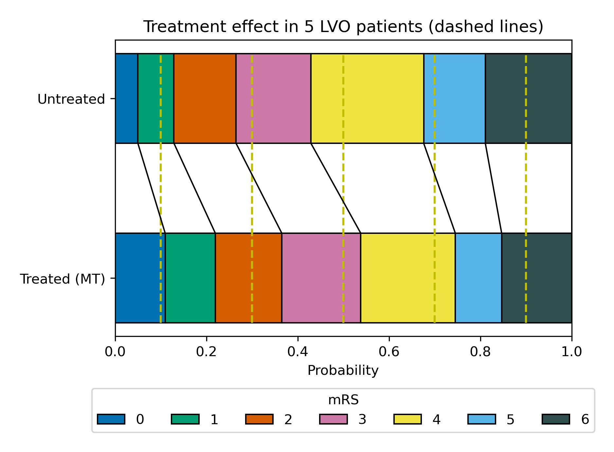

# Predicting disability outcomes and utility after treatment of stroke with thrombolysis (IVT) or thrombectomy (MT)

This online Jupyter describes the basic methodology for estimating disability outcomes for stroke patients, depending on time to treatment with intravenous thrombolysis (IVT) or mechanical thrombectomy (MT). The orignal code for the book may be found at [https://github.com/samuel-book/stroke_outcome](https://github.com/samuel-book/stroke_outcome).

The methodology described here is for patients with an ischaemic stroke (a stroke that is caused by a clot). These patients can be further defined by the location of the clot: those with a large vessel occlusion (LVO); and those not with a large vessel occlusion (nLVO). Patients with an nLVO can be treated with thrombolysis (IVT), a clot-busting medication. Patients with an LVO can be treated with IVT and/or thrombectomy (MT), which physically removes the clot. The benefit received by the patient from either treatment (IVT and/or MT) are time dependent, such that the sooner they are administered, the better the outcome, with each treatment having no effect after a specified duration (6.3 hours for IVT, and 8 hours for MT). In other words, the sooner a patient recieves reperfusion treatment the fewer stroke related disabilities they could end up with.

Until now, modelling the outcome from stroke reperfusion treatment was a dichotomous affair, with a patient classified as either being disability free, or with stroke related disabilities. The method described here aims to provide a more granular disability outcome, describing the resulting disability as one of six levels (ranging from disability free, to death).

This method calculates disability outcome estimates for three patient-treatment cohorts: 1) nLVO-IVT (patients with an nLVO that are treated with IVT), 2) LVO-IVT (patients with an LVO that are treated with IVT), 3) LVO-MT (patients with an LVO that are treated with MT). The result is provided as a distribution of disability (with six levels) following reperfusion treatment at any point between these two time stages: 1) receiving reperfusion treatment as soon as their stroke began (this will be referred to as time of stroke onset, and we will use the terminology "*t = 0*"), and 2) receiving reperfusion treatment at the duration after stroke onset where the treatment has no effect (this will be referred to as time of no effect, and we will use the terminology "*t = No Effect*").

The method is built using data from reperfusion treatment clinical trials (Lees et al. 2010, Emberson et al. 2014, Goyal et al. 2016, Fransen et al. 2016, and Hui et al. 2020) and 3 years worth of stroke admission data for England and Wales (Sentinel Stroke National Audit Programme, SSNAP) to define the distribution of disability for each of the three patient-treatment cohorts at the two time stages (*t = 0* & *t = No Effect*), and we use interpolation to determine the disability distribution at any point inbetween. 

Detailed methodology and code are found in the notebooks on [derivation of mRS distributions](./mRS_datasets_full.ipynb) and [decay of effect over time](./mRS_outcomes_maths).

## Modified Rankin Scale

Disability levels may be measured in various ways. In this project we are using the modified Rankin Scale (mRS). It is a commonly used scale for measuring the degree of disability or dependence in the daily activities of people who have suffered a stroke.

The scale runs from 0-6, running from perfect health without symptoms to death:

| Score | Description                                                                                                            |
|-------|------------------------------------------------------------------------------------------------------------------------|
| 0     | No symptoms.                                                                                                           |
| 1     | No significant disability. Able to carry out all usual activities, despite some symptoms.                              |
| 2     | Slight disability. Able to look after own affairs without assistance, but unable to carry out all previous activities. |
| 3     | Moderate disability. Requires some help, but able to walk unassisted.                                                  |
| 4     | Moderately severe disability. Unable to attend to own bodily needs without assistance, and unable to walk unassisted.  |
| 5     | Severe disability. Requires constant nursing care and attention, bedridden, incontinent.                               |
| 6     | Dead.                                                                                                                  |

Note: From this point onwards we will refer to disability distributions as mRS distributions.

## Method and Results

This model contains mRS outcome distributions for three patient-treatment cohorts: 1) nLVO-IVT, 2) LVO-IVT, 3) LVO-MT. For each patient-treatment cohort, we estimate two mRS distributions: one mRS distribution if treatment is given at *t = 0* (time of stroke onset), and one mRS distribution if treatment is given at *t = No Effect* (time of no effect). In order to estimate these two mRS distributions, we use data from reperfusion treatment clinical trials and stroke admission data from England and Wales. To select the relevant patients for each cohort we will use the National Institutes of Health Stroke Scale (NIHSS) on arrival as a surrogate to classify patients as nLVO (NIHSS 0-10) or LVO (NIHSS 11+).

All mRS distributions created are based on the assumption that, following treatment, the mRS distribution will lie between two extremes: 1) reperfusion perfectly restores function, and the resulting mRS distribution is the same as the pre-stroke mRS distribution (this data is obtained from the SSNAP dataset), and 2) reperfusion treatment fails to restore any function and the resulting mRS distribution is the same as a control untreated population, though with added excess deaths that may be caused by the treatment. To create required mRS distributions we find a weighting between these two extremes that give us a distribution that matches published reference points.

The *t = 0* mRS distributions are calculated to give the expected mRS distributions if treatment was given immediately after stroke onset, and also include the risk of excess deaths caused by taking the treatment. Further details specific to stroke type and treatment type are given below.

The *t = No Effect* mRS distributions are based on mRS distribution data when patients did not receive any treatment (this represents what will happen if the patient takes the treatment at *t = No Effect*). This data is obtained from the untreated control group in clinical trials and further adjusted to include the risk of excess deaths caused by taking the treatment. Further details specific to stroke type and treatment type are given below.

The two obtained mRS distribution estimates (one for *t = 0*, and one for *t = No Effect*) are shown in two different plot formats: a block plot (with *t = 0* at the top and *t = No Effect* at the bottom) and a line plot (with *t = 0* on the left, *t = No Effect* on the right, and the space between these points show the mRS distribution for any point between these times). Below we will describe how we derived the two mRS distributions, and how they are represented in each of the charts, for each patient-treatment cohort in turn.

## Patient-treatment cohort 1: nLVO-IVT

This section describes the methodology used to obtain the two mRS distribution estimates (*t = 0* and *t = No Effect*) for the patients with an nLVO that are treated with IVT.

### mRS distribution at *t = 0* (for nLVO-IVT)

We assume that the mRS distribution for patients treated at *t = 0* will be a weighted average of a full recovery distribution, and a no-benefit distribution, including a correction for risk of treatment-related death (we assume that risk is independent of the time treatment is given). We need a mRS distribution for each of these, and then take a weighted combination (61% fully recovered & 39% no effect), where the weights are informed by Emberson et al. 2014.

The **mRS distribution for fully recovered nLVO patients with IVT** at *t = 0* is taken as the pre-stroke mRS distribution (this will represent a patient receiving a 100% effective treatment). This distribution comes from the SSNAP dataset, extracting the patients that have an ischaemic stroke and using NIHSS 0-10 as a surrogate for nLVO. This mRS distribution is then corrected for the excess deaths due to treatment with IVT for nLVO patients (1.10%, see appendix).

The **mRS distribution for nLVO patients for which IVT had no effect** is assumed to be the same as patients that were not treated, but adjusted to include the risk of excess death caused by taking the treatment. Unfortunately there does not exist a large clinical trial for just nLVO patients from which we can take the results for the untreated control group. Instead we use the untreated control group of combined nLVO/LVO data from Lees et al. 2010, and from that we remove the contribution of the LVO patients by using the results from the untreated control group of LVO-only data from Goyal et al. 2016. Each mRS distribution (Lees, and Goyal) are adjusted to account for the excess deaths due to IVT treatment, this is 2.29% for the combined nLVO/LVO patients and 3.41% for LVO patients (see appendix). Weightings for these two mRS distributions (154% Lees and -54% Goyal) are chosen such that once the contribution from the LVO patients have been removed from the combined nLVO/LVO distribution, the remaining mRS distribution matches the P(mRS <= 1, *t = No Effect*) of 0.46 (from the control group in Emberson with NIHSS of 0-10).

The **weights** used to combine these two mRS distribution (61% fully recovered & 39% no effect) were informed by data from Emberson et al. 2014, and found in order to match the P(mRS <= 1, *t = 0*) of 0.63. It is seen from Emberson that 46% of patients with NIHSS 0-10 had mRS 0-1 in the untreated group (see figure 2 Emberson et al. 2014: (189 + 538)/(321 + 1252)). This translates into a 0.85 odds of a good outcome, which, when multipied by the odds ratio for mRS 0-1 at *t = 0* (which is 2.0, obtained from extrapolating back to *t = 0* in figure 1 "Effect of timing of alteplase treatment on good stroke outcome, mRS 0–1"), gives 1.70, before converting to a probability of 63%.

### mRS distribution at *t = No Effect* (for nLVO-IVT)

As described above (repeated here for completeness), we  assume that patients treated at *t = No Effect* will have the same mRS distribution as patients that were not treated, but adjusted to include the risk of excess death caused by taking the treatment. Unfortunately there does not exist a large clinical trial for just nLVO patients from which we can take the results for the untreated control group. Instead we use the untreated control group of combined nLVO/LVO data from Lees et al. 2010, and from that we remove the contribution of the LVO patients by using the results from the untreated control group of LVO-only data from Goyal et al. 2016. Each mRS distribution (Lees, and Goyal) are adjusted to account for the excess deaths due to IVT treatment, this is 2.29% for the combined nLVO/LVO patients and 3.41% for LVO patients (see appendix). Weightings for these two mRS distributions (154% Lees and -54% Goyal) are chosen such that once the contribution from the LVO patients have been removed from the combined nLVO/LVO distribution, the remaining mRS distribution matches the P(mRS <= 1, *t = No Effect*) of 0.46 (from the control group in Emberson with NIHSS of 0-10).

### Block plot showing the mRS distribution estimates for *t = 0* and *t = No Effect* (for nLVO-IVT)

Here we use a block plot to show the expected mRS distribution for nLVO strokes if IVT is given at either time of stroke onset (*t = 0*, upper plot) or time when the effect of treatment has decayed to zero (*t = No Effect*, lower plot), shown in {numref}`figure {number} <nLVO_IVT_dist>`.

:::{figure-md} nLVO_IVT_dist

Expected mRS distribution for nLVO strokes if IVT given at time of stroke onset (*t = 0*), or if IVT given at time when the effect has decayed to zero (*t = No Effect*). Both distributions include IVT-related excess deaths due to fatal intracranial haemorrhage.
:::

### Line plot showing mRS distribution estimates: Relationship between time to treatment and effect (for nLVO-IVT)

Here we use a line plot to show the expected mRS distribution for nLVO strokes if IVT is given at any time between *t = 0* (left) and *t = No Effect* (right). It is assumed that the log odds decay uniformly over time between *t = 0* and *t = No Effect* (as modelled by Emberson et al. for IVT). The time at which being given treatment has no-effect is taken as 6.3 hours for IVT (Emberson et al. 2014).

The modelled decay of effects of IVT for nLVO strokes is shown in {numref}`figure {number} <nLVO_IVT_time>`. 

:::{figure-md} nLVO_IVT_time

Expected mRS distribution for nLVO strokes depending on time to treatment with IVT.
:::

## Patient-treatment cohort 2: LVO-IVT

This section describes the methodology used to obtain the two mRS distribution estimates (*t = 0* and *t = No Effect*) for the patients with an LVO that are treated with IVT.

### mRS distribution at *t = 0* (for LVO-IVT)

We assume that the mRS distribution for patients treated at *t = 0* will be a weighted average of a full recovery distribution, and a no-benefit distribution, including a correction for risk of treatment-related death (we assume that risk is independent of the time treatment is given). We need a mRS distribution for each of these, and then take a weighted combination (18% fully recovered & 82% no effect), where the weights are informed by Emberson et al. 2014.

The **mRS distribution for fully recovered LVO patients with IVT** at *t = 0* is taken as the pre-stroke mRS distribution (this will represent a patient receiving a 100% effective treatment). This distribution comes from the SSNAP dataset, extracting the patients that have an ischaemic stroke and using NIHSS 11+ as a surrogate for LVO. This mRS distribution is then corrected for the excess deaths due to treatment with IVT for LVO patients (3.41%, see appendix).

The **mRS distribution for LVO patients for which IVT had no effect** is assumed to be the same as patients that were not treated, but adjusted to include the risk of excess death caused by taking the treatment. We obtained this mRS distribution by taking the untreated control group population from Goyal et al. 2016. This distribution is then corrected for the excess deaths due to treatment with IVT for LVO patients (3.41%, see appendix).

The **weights** used to combine these two mRS distributions (18% fully recovered & 82% no effect) are chosen to match predicted P(mRS <= 1, *t = 0*) of 0.20, which is set as a target by extrapolating the control group mRS for patients with NIHSS 11+ from Emberson et al. 2014 back to a predicted odds ratio of mRS 0-1 of 2.0 at *t = 0*.

### mRS distribution at *t = No Effect* (for LVO-IVT)

We assume that patients treated at *t = No Effect* will have the same mRS distribution as patients that were not treated, with an adjustment to include the risk of excess deaths caused by taking the treatment. We obtained this mRS distribution by taking the untreated control population from Goyal et al. 2016. This distribution is then corrected for the excess deaths due to treatment with IVT for LVO patients (3.41%, see appendix).

### Block plot showing the mRS distribution estimates for *t = 0* and *t = No Effect* (for LVO-IVT)

Here we use a block plot to show the expected mRS distribution for LVO strokes if IVT is given at either time of stroke onset (*t = 0*, upper plot) or time when the effect of treatment has decayed to zero (*t = No Effect*, lower plot), shown in {numref}`figure {number} <LVO_IVT_dist>`.

:::{figure-md} LVO_IVT_dist

Expected mRS distribution for LVO strokes if IVT given at time of stroke onset (*t = 0*), or if IVT given at time when there effect has decayed to zero (*t = No Effect*). Both distributions include IVT-related excess deaths due to fatal intracranial haemorrhage.
:::

### Line plot showing mRS distribution estimates: Relationship between time to treatment and effect (for LVO-IVT)

Here we use a line plot to show the expected mRS distribution for LVO strokes if IVT is given at any time between *t = 0* (left) and *t = No Effect* (right). It is assumed that the log odds decay uniformly over time between *t = 0* and *t = No Effect* (as modelled by Emberson et al. for IVT). The time at which being given treatment has no-effect is taken as 6.3 hours for IVT (Emberson et al. 2014).

The modelled decay of effects of IVT for LVO strokes is shown in {numref}`figure {number} <nLVO_IVT_time>`. 

:::{figure-md} LVO_IVT_time

Expected mRS distribution for LVO strokes depending on time to treatment with IVT.
:::

## Patient-treatment cohort 3: LVO-MT

This section describes the methodology used to obtain the two mRS distribution estimates (*t = 0* and *t = No Effect*) for the patients with an LVO that are treated with MT.

### mRS distribution at *t = 0* (for LVO-MT)

We assume that the mRS distribution for patients treated at *t = 0* will be a weighted average of a full recovery distribution, and a no-benefit distribution, including a correction for risk of treatment-related death (we assume that risk is independent of the time treatment is given). We need a mRS distribution for each of these, and then take a weighted combination (75% fully recovered & 25% no effect), where the weights are taken from Hui et al. 2020.

The **mRS distribution for fully recovered LVO patients with MT** at *t = 0* is taken as the pre-stroke mRS distribution (this will represent a patient receiving a 100% effective treatment). This distribution comes from the SSNAP dataset, extracting the patients that have an ischaemic stroke and using NIHSS 11+ as a surrogate for LVO. This distribution is then corrected for the excess deaths due to treatment with MT (3.6%, see appendix).

The **mRS distribution for LVO patients for which MT had no effect** is assumed to be the same as patients that were not treated, but adjusted to include the risk of excess death caused by taking the treatment. We obtained this mRS distribution by taking the untreated control population from Goyal et al. 2016. This distribution is then corrected for the deaths due to treatment with MT (3.6%, see appendix).

The **weights** used to combine these two mRS distributions (75% fully recovered & 25% no effect) are taken from Hui et al. 2020, who reported 75% successful recanalisation with thrombectomy.

*Extrapolating results of good outcome, when recanalisation has been achieved with MT, from Fransen et al. 2016 back to *t = 0*, assuming 75% recanalisation, gives the same proportion of patients with mRS <= 2 as the pre-stroke mRS in the SSNAP data (therefore this extrapolation would suggest full recovery of all health with MT theoretically carried out at *t = 0*).

### mRS distribution at *t = No Effect* (for LVO-MT)

We assume that patients treated at *t = No Effect* will have the same mRS distribution as patients that were not treated, and adjusted to include the risk of excess deaths caused by taking the treatment. We obtained this mRS distribution by taking the untreated control population from Goyal et al. 2016. This distribution is then corrected for the excess deaths due to treatment with MT (3.6%, see appendix).

### Block plot showing the mRS distribution estimates for *t = 0* and *t = No Effect* (for LVO-MT)

Here we use a block plot to show the expected mRS distribution for LVO strokes if MT is given at either time of stroke onset (*t = 0*, upper plot) or time when the effect of treatment has decayed to zero (*t = No Effect*, lower plot), shown in {numref}`figure {number} <LVO_MT_dist>`. 

:::{figure-md} LVO_MT_dist

Expected mRS distribution for LVO strokes if MT given at time of stroke onset (*t = 0*), or if MT given at time when there effect has decayed to zero (*t = No Effect*. Both distributions include MT-related excess deaths.
:::

### Line plot showing mRS distribution estimates: Relationship between time to treatment and effect (for LVO-MT)

Here we use a line plot to show the expected mRS distribution if MT is given at any time between *t = 0* (left) and *t = No Effect* (right). It is assumed that the log odds decay uniformly over time between *t = 0* and *t = No Effect* (as modelled by Fransen et al. for MT). The time to no-effect treatment is taken as 8 hours for MT (Fransen et al). Note: the time to no effect from Fransen et al. did not include those patients who may be selected for late treatment based on advanced imaging. In this method we do not include late-presenting patients in our outcome modelling.

The modelled decay of effects of MT are shown in {numref}`figure {number} <LVO_MT_time>`. 

:::{figure-md} LVO_MT_time

Expected mRS distribution for LVO strokes depending on time to treatment with MT.
:::

## Note on comparator control groups

In our calculations above, we include treatment-related deaths in our predicted mRS distribution. When estimating the clinical benefit of reperfusion treatment we calculate mRS distributions for untreated patients, without the addition of excess deaths. The method is similar to those described above, but without addition of excess deaths. Calculations may be found in the found in the [derivation of mRS distributions](./mRS_datasets_full.ipynb) notebook.

## Utility-weighted mRS outcomes

In addition to mRS, we may calculate utility-weighted mRS (UW-mRS).

UW-mRS incorporates both treatment effect and patient perceived quality of life as a single outcome measure for stroke trials.

UW-mRS scores are based on a pooled analysis of 20,000+ patients, from Wang et al (2020). The Utilities for each mRS level are shown below.  

| mRS Score | 0    | 1    | 2    | 3    | 4    | 5     | 6    |
|-----------|------|------|------|------|------|-------|------|
| Utility   | 0.97 | 0.88 | 0.74 | 0.55 | 0.20 | -0.19 | 0.00 |

## Summary plots

The effect of time to treatment with IVT or MT, in isolation is shown in {numref}`figure {number} <time_to_treatment>`. The combined effect of IVT and MT in a mixed nLVO/LVO population is shown in {numref}`figure {number} <utility_all>`

:::{figure-md} time_to_treatment

The effect of time to treatment on effectiveness of treatment, shown individually for nLVO treated with IVT, and LVO treated with MT or IVT alone (the effect of MT is based on clinical trails where 85% of patients had previously received IVT). Effectiveness is shown as mean mRS (left) , the proportion of patients with mRS <= 2 (middle), and added utility (right). 
:::

:::{figure-md} utility_all

The effect of time to treatment with IVT and MT on a mixed nLVO/LVO population (LVO making up 35% of all treated ischaemic strokes).
:::

## Example of sampled mRS distribution shift

Figure {numref}`{number} <treatment_shift>` shows the effect of thrombectomy delivered at 120 mins after a stroke in five patients. Each patient has a value of 'P' sampled from a range of 0-1.

* Patient #1 (P=0.1): mRS untreated = 1, mRS treated = 0
* Patient #2 (P=0.3): mRS untreated = 3, mRS treated = 1
* Patient #3 (P=0.5): mRS untreated = 4, mRS treated = 3
* Patient #4 (P=0.7): mRS untreated = 5, mRS treated = 4
* Patient #5 (P=0.9): mRS untreated = 6, mRS treated = 6

:::{figure-md} treatment_shift

The predicted effect of treatment of a selection of five patients with LVO, given thrombectomy at 120 mins after stroke. The dotted lines represent the mRS shift for each patient if they received no treatment (top), or received MT at 120 minutes after stroke onset (bottom).
:::

## References used in modelling

de la Ossa Herrero N, Carrera D, Gorchs M, Querol M, Millán M, Gomis M, et al. Design and Validation of a Prehospital Stroke Scale to Predict Large Arterial Occlusion The Rapid Arterial Occlusion Evaluation Scale. Stroke; a journal of cerebral circulation. 2013 Nov 26;45. 

Emberson J, Lees KR, Lyden P, et al. _Effect of treatment delay, age, and stroke severity on the effects of intravenous thrombolysis with alteplase for acute ischaemic stroke: A meta-analysis of individual patient data from randomised trials._ The Lancet 2014;384:1929–35. doi:10.1016/S0140-6736(14)60584-5

Fransen, P., Berkhemer, O., Lingsma, H. et al. Time to Reperfusion and Treatment Effect for Acute Ischemic Stroke: A Randomized Clinical Trial. JAMA Neurol. 2016 Feb 1;73(2):190–6. DOI: 10.1001/jamaneurol.2015.3886

Goyal M, Menon BK, van Zwam WH, et al. _Endovascular thrombectomy after large-vessel ischaemic stroke: a meta-analysis of individual patient data from five randomised trials._ The Lancet 2016;387:1723-1731. doi:10.1016/S0140-6736(16)00163-X

Hui W, Wu C, Zhao W, Sun H, Hao J, Liang H, et al. Efficacy and Safety of Recanalization Therapy for Acute Ischemic Stroke With Large Vessel Occlusion. Stroke. 2020 Jul;51(7):2026–35. 

IST-3 collaborative group, Sandercock P, Wardlaw JM, Lindley RI, Dennis M, Cohen G, et al. The benefits and harms of intravenous thrombolysis with recombinant tissue plasminogen activator within 6 h of acute ischaemic stroke (the third international stroke trial [IST-3]): a randomised controlled trial. Lancet. 2012 379:2352-63.

Lees KR, Bluhmki E, von Kummer R, et al. _Time to treatment with intravenous alteplase and outcome in stroke: an updated pooled analysis of ECASS, ATLANTIS, NINDS, and EPITHET trials_. The Lancet 2010;375:1695-703. doi:10.1016/S0140-6736(10)60491-6

McMeekin P, White P, James MA, Price CI, Flynn D, Ford GA. Estimating the number of UK stroke patients eligible for endovascular thrombectomy. European Stroke Journal. 2017;2:319–26. 

SAMueL-1 data on mRS before stroke (DOI: 10.5281/zenodo.6896710): https://samuel-book.github.io/samuel-1/descriptive_stats/08_prestroke_mrs.html

Wang X, Moullaali TJ, Li Q, Berge E, Robinson TG, Lindley R, et al. Utility-Weighted Modified Rankin Scale Scores for the Assessment of Stroke Outcome. Stroke. 2020 Aug 1;51(8):2411-7.

## Notes

* In Goyal's metanalysis of MT, 85.1% of patients in the trial had also received IVT. The trial results therefore mostly reflect IVT/MT vs MT alone. If patients first attend an IVT-only centre, then it is possible that if they respond well to IVT they will not proceed to MT (they are, arguably, more likely to proceed to MT when IVT and MT are more tightly coupled in time). The overall benefit in LVO patients is likely to a conditional sum of IVT and MT benefit - that is patients may first benefit from IVT, and those patients who do not respond well to IVT may benefit from additional MT. Currently in the UK 52% of patients are admitted directly to an MT-capable centre (Phil White, private communication). 

## Appendix

### Excess deaths due to treatment

#### IVT deaths due to fatal intracranial haemorrhage (Emberson et al., 2014): 

| NIHSS | Treated | Control | Excess |
|-------|---------|---------|--------|
| 0-10  | 1.41%   | 0.32%   | 1.10%  |
| 11+   | 3.85%   | 0.45%   | 3.41%  |
| All   | 2.68%   | 0.39%   | 2.29%  |

Excess deaths due to IVT are assumed to occur independently of time. Differing risks of death are applied according to whether the patient is assumed nLVO (NIHSS 0-10 as a surrogate for nLVO) or LVO (NIHSS 11+, as a surrogate for LVO). Note: Rounding errors exist in the "Excess" column.

We use Embersons 2.29% excess deaths from IVT on all patients (nLVO and LVO) with the combined nLVO/LVO population from Lees et al. 2010. From the available trial data, we assume that the split between nLVO/LVO is as near the same in both Lees and Emberson:
* Lees has 3670 patients, they provide a granular level of mRS distribution for their population (combined nLVO/LVO) but they do not provide the proportions of the split.
* Emberson has 6756 patients (they have the 3035 patients from IST-3 in addition to those in Lees, with 51 unaccounted for), they provide the excess deaths by stroke severity. To obtain their value of 2.29% excess deaths from IVT for all patients, this requires a weighting of 48.27% nLVO and 51.73% LVO.
* IST-3 has 3035 patients and provide proportion of patients by stroke severity: 48.24% nLVO and 51.76% LVO. This is as near as the same that we have calculated in Emberson.
* Assuming that Lees contains the other patients in Emberson (those not from IST-3), then it is a fair assumption that Lees has the same split (nLVO/LVO) of patients as Emberson, and so can use 2.29% excess deaths from IVT for Lees combined nLVO/LVO population.

#### MT deaths (Goyal et al., 2016):

| Treated | Control | Excess |
|---------|---------|--------|
| 18.9%   | 15.3%   | 3.6%   |

The control group in Goyal et al. do not receive MT, but do receive other interventions such as IVT (used in 83% of patients). No additional IVT-related deaths need to be considered when modelling use of MT as the control group (used to estimate the effect of MT at a time MT is no longer effective) already includes IVT-related excess deaths.
