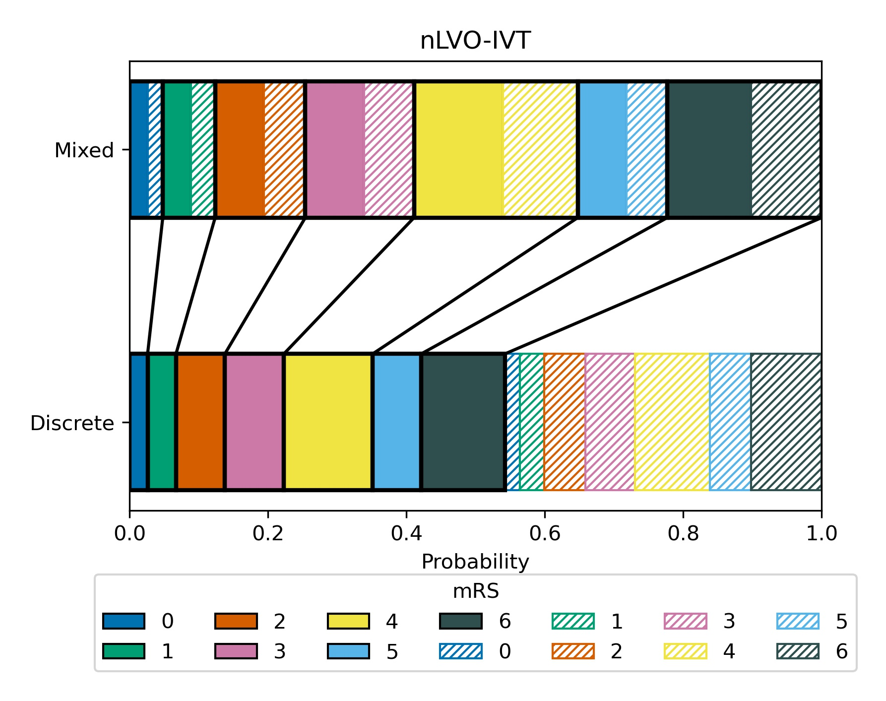
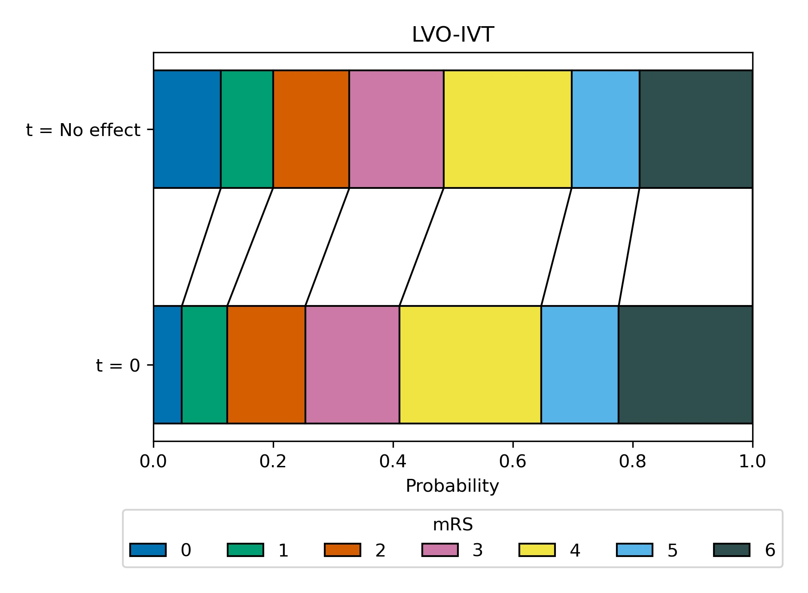
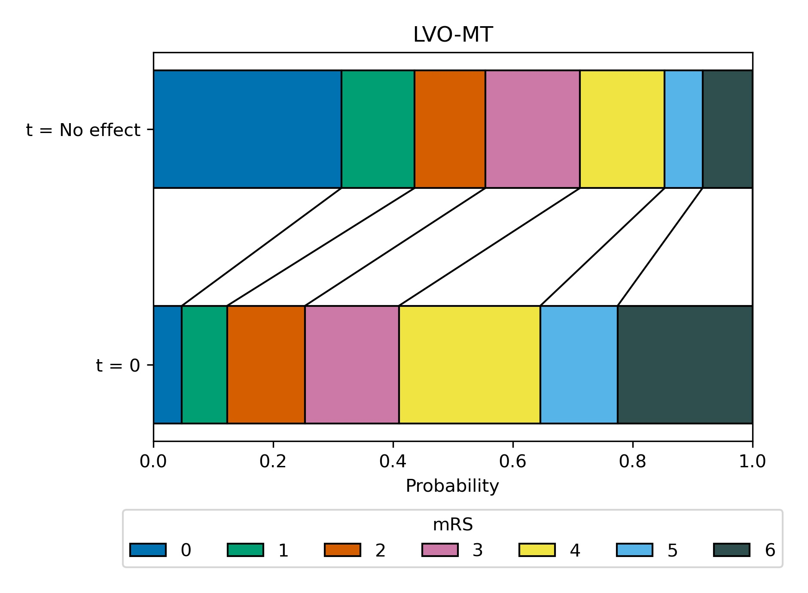

# Predicting granular disability outcomes after treatment of stroke with thrombolysis (IVT) or thrombectomy (MT)

This notebook describes the basic methodology for estimating disability outcomes for stroke patients, depending on time to treatment with intravenous thrombolysis (IVT) or mechanical thrombectomy (MT).

The methodology described here is for patients with an ischaemic stroke (a stroke that is caused by a clot). These patients can be further defined by the location of the clot: those with a large vessel occlusion (LVO); and those not with a large vessel occlusion (nLVO). Patients with an nLVO can be treated with thrombolysis (IVT), a clot-busting medication. Patients with an LVO can be treated with IVT and/or thrombectomy (MT), which physically removes the clot. The benefit received by the patient from either treatment (IVT and/or MT) are time dependent, such that the sooner they are administered, the better the outcome, with each treatment having no effect after a specified duration (6.3 hours for IVT, and 8 hours for MT). In other words, the sooner a patient recieves reperfusion treatment the fewer stroke related disabilities they could end up with.

Until now, modelling the outcome from stroke reperfusion treatment was a dichotomous affair, with a patient classified as either being disability free, or with stroke related disabilities. This method described here aims to provide a more granular disability outcome, describing the resulting disability as one of six levels (ranging from disability free, to death).

This method calculates disability outcome estimates for three patient-treatment cohorts: 1) nLVO-IVT, 2) LVO-IVT, 3) LVO-MT. The result is provided as a distribution of disability (with six levels) following reperfusion treatment at any point between these two time stages: 1) receiving reperfusion treatment as soon as their stroke began (this will be referred to as time zero, and we will use the terminology "t=0"), and 2) receiving reperfusion treatment at the duration after stroke onset where the treatment has no effect (this will be referred to as time no effect, and we will use the terminology "t=NE").

The method is built using data from reperfusion treatment clinical trials (Lees et al. 2010, Emberson et al. 2014, Goyal et al. 2016, Fransen et al. 2016, and Hui et al. 2020) and from national stroke databases (Sentinel Stroke National Audit Programme, SSNAP) to define the distribution of disability for each of the three patient-treatment cohorts at the two time stages (t=0 & t=NE), and we use interpolation to determine the disability distribution at any point inbetween. 

Detailed methodology and code are found in the notebooks on [derivation of mRS distributions at time of stroke onset and time when effect has decayed away](./mRS_datasets_full.ipynb) and [decay of effect over time](./mRS_outcomes_maths).

## Modified Rankin Scale

Disability levels may be measured in various ways. In this project we are using the modified Rankin Scale (mRS). It is a commonly used scale for measuring the degree of disability or dependence in the daily activities of people who have suffered a stroke.

The scale runs from 0-6, running from perfect health without symptoms to death:

| Score | Description |
|---|---|
| 0 | No symptoms. |
| 1 | No significant disability. Able to carry out all usual activities, despite some symptoms. |
| 2 | Slight disability. Able to look after own affairs without assistance, but unable to carry out all previous activities. |
| 3 | Moderate disability. Requires some help, but able to walk unassisted. |
| 4 | Moderately severe disability. Unable to attend to own bodily needs without assistance, and unable to walk unassisted. |
| 5 | Severe disability. Requires constant nursing care and attention, bedridden, incontinent. |
| 6 | Dead. |

Note: From this point onwards we will refer to disability distributions as mRS distributions.

## Methodology

This model contains mRS outcome distributions for three patient-treatment cohorts: 1) nLVO-IVT, 2) LVO-IVT, 3) LVO-MT. For each patient-treatment cohort, we estimate two mRS distributions: one mRS distribution if treatment is given at t=0 (time of stroke onset), and one mRS distribution if treatment is given at t=NE (time of no effect). In order to estimate these two mRS distributions, we use data from reperfusion treatment clinical trials and from national stroke databases. To select the relevant patients for each cohort we will use the National Institutes of Health Stroke Scale (NIHSS) on arrival as a surrogate to classify patients as nLVO (NIHSS 0-10) or LVO (NIHSS 11+).

The t=0 mRS distributions are based on the assumption that if reperfusion treatment is given immediately to a patient at stroke onset, there are only two possible outcomes for the patient. They are either 1) returned to their pre-stroke disability level (this data is obtained from the SAMueL dataset, or 2) the treatment has had no effect to combat the disability caused by a stroke (this data is obtained from the untreated control group in clinical trials and adjusted to include the risk of excess deaths caused by taking the treatment). Using published data we obtain the relevant weighting to use to combine these two distributions to represent the t=0 mRS distribution.

The t=NE mRS distributions are based on mRS distribution data when patients did not receive any treatment (this represents what will happen if the patient takes the treatment at t=NE). This data is obtained from the untreated control group in clinical trials and adjusted to include the risk of excess deaths caused by taking the treatment.

The two obtained mRS distribution estimates (one for t=0, and one for t=NE) are shown in two different plot formats: a block plot (with t=0 at the top and t=NE at the bottom) and a line plot (with t=0 on the left, t=NE on the right, and the space between these points show the mRS distribution for any duration between these times). Below we will describe how we derived the two mRS distributions, and how they are represented in each of the charts, for each patient-treatment cohort in turn.

## Patient-treatment cohort 1: nLVO-IVT

This section describes the methodology used to obtain the two mRS distribution estimates (t=0 and t=NE) for the patients with an nLVO that are treated with IVT.

### mRS distribution at t=0 (for nLVO-IVT)

We assume patients treated at t=0 are either fully recovered, or the treatment had no effect. We need a mRS distribution for each of these, and then take a weighted combination (61% fully recovered & 39% no effect), where the weights are informed by Emberson et al. 2014.

The mRS distribution for fully recovered nLVO patients with IVT at t=0 is taken as the pre-stroke mRS distribution (this will represent a patient receiving a 100% effective treatment). This distribution comes from the SAMueL dataset, extracting the patients that have an ischaemic stroke and using NIHSS 0-10 as a surrogate for nLVO. This mRS distribution is then corrected for the excess deaths due to treatment with IVT for nLVO patients (1.10%, see appendix).

The mRS distribution for patients for which the treatment had no effect at t=0 is taken from the untreated control group of nLVO. MIKE NEED MORE INFO FOR THIS. COULD NOT FIND WHERE THIS CAME FROM.

The weights used to combine these two mRS distributions (61% fully recovered & 39% no effect) were informed by data from Emberson et al. 2014, and found in order to match the P(mRS <= 1, t=0) of 0.63. It is seen from Emberson that 46% of patients with NIHSS 0-10 had mRS 0-1 in the untreated group (see figure 2 Emberson et al. 2014: (189 + 538)/(321 + 1252)). This translate into a 0.85 odds of a good outcome, which, when multipied with the odds ratio for mRS 0-1 at t=0 (which is 2.0, obtained from extrapolating back to t=0 in figure 1 "Effect of timing of alteplase treatment on good stroke outcome, mRS 0–1"), gives 1.70, before converting to a probability of 63%.

### mRS distribution at t=NE (for nLVO-IVT)

We assume that patients treated at t=NE will have the same mRS distribution as patients that were not treated, and adjusted to include the risk of excess deaths caused by taking the treatment. We obtained this mRS distribution by taking the weighted combination of the untreated control group of combined nLVO/LVO data from Lees et al. 2010 (67%) and the untreated control group of LVO-only data from Goyal et al. 2016 (33%). Weightings are chosen to match the P(mRS <= 1) of 46% (from the control group in Emberson with NIHSS of 0-10). This distribution is then corrected for the excess deaths due to treatment with IVT.

### Block plot showing the mRS distribution estimates (for nLVO-IVT)

Here we use a block plot to show the expected mRS distribution for nLVO strokes if IVT is given at either time of stroke onset (t=0, at top of plot) or time when the effect of treatment has decayed to zero (t=NE, at bottom of plot), shown in {numref}`figure {number} <nLVO_IVT_dist>`.

:::{figure-md} nLVO_IVT_dist

Expected mRS distribution for nLVO strokes if IVT given at time of stroke onset (*t=0*), or if IVT given at time when the effect has decayed to zero (known as the *No effect time*, at this point there are still IVT-related excess deaths due to fatal intracranial haemorrhage).
:::

#### Line plot showing mRS distribution estimates: Relationship between time to treatment and effect (for nLVO-IVT)

Here we use a line plot to show the expected mRS distribution for nLVO strokes if IVT is given at any time between t=0 and t=NE. It is assumed that the log odds decay uniformly over time between t=0 and t=NE (as modelled by Emberson et al. for IVT). The time at which being given treatment has no-effect is taken as 6.3 hours for IVT (Emberson et al. 2014).

The modelled decay of effects of IVT for nLVO strokes is shown in {numref}`figure {number} <nLVO_IVT_time>`. 

:::{figure-md} nLVO_IVT_time

Expected mRS distribution for nLVO strokes depending on time to treatment with IVT.
:::

## Patient-treatment cohort 2: LVO-IVT

This section describes the methodology used to obtain the two mRS distribution estimates (t=0 and t=NE) for the patients with an LVO that are treated with IVT.

### mRS distribution at t=0 (for LVO-IVT)

We assume patients treated at t=0 are either fully recovered, or the treatment had no effect. We need a mRS distribution for each of these, and then take a weighted combination (18% fully recovered & 82% no effect), where the weights are informed by Emberson et al. 2014.

The mRS distribution for fully recovered LVO patients with IVT at t=0 is taken as the pre-stroke mRS distribution (this will represent a patient receiving a 100% effective treatment). This distribution comes from the SAMueL dataset, extracting the patients that have an ischaemic stroke and using NIHSS 11+ as a surrogate for LVO. This mRS distribution is then corrected for the excess deaths due to treatment with IVT for LVO patients (3.41%, see appendix).

The mRS distribution for patients for which the treatment had no effect at t=0 is taken from the untreated control group population from Goyal et al. 2016. This distribution is then corrected for the excess deaths due to treatment with IVT for LVO patients (3.41%).

The weights used to combine these two mRS distributions (18% fully recovered & 82% no effect) are chosen to match P(mRS <= 1, t=0) of 0.20, which is set as a target by extrapolating the control group mRS for patients with NIHSS 11+ from Emberson et al. 2014 back to a predicted odds ratio of mRS 0-1 of 2.0 at t=0.

### mRS distribution at t=NE (for LVO-IVT)

We assume that patients treated at t=NE will have the same mRS distribution as patients that were not treated, and adjusted to include the risk of excess deaths caused by taking the treatment. We obtained this mRS distribution by taking the control population from Goyal et al. 2016. This distribution is then corrected for the excess deaths due to treatment with IVT for LVO patients (3.41%, see appendix).

### Block plot showing the mRS distribution estimates (for LVO-IVT)

Here we use a block plot to show the expected mRS distribution for LVO strokes if IVT is given at either time of stroke onset (t=0, at top of plot) or time when the effect of treatment has decayed to zero (t=NE, at bottom of plot), shown in {numref}`figure {number} <LVO_IVT_dist>`.

:::{figure-md} LVO_IVT_dist

Expected mRS distribution for LVO strokes if IVT given at time of stroke onset (*t=0hr*), or if IVT given at time when there effect has decayed to zero (known as the *No effect time*, at this point there are still IVT-related excess deaths due to fatal intracranial haemorrhage).
:::

#### Line plot showing mRS distribution estimates: Relationship between time to treatment and effect (for LVO-IVT)

Modelling of the effect of IVT after any given treatment time assumes that the log odds decay uniformly over time between stroke onset and the time to no effect (as modelled by Emberson et al. for IVT). The time to no-effect treatment is taken as 6.3 hours for IVT (Emberson et al.).

The modelled decay of effects of IVT is shown in {numref}`figure {number} <nLVO_IVT_time>`. 

:::{figure-md} LVO_IVT_time

Expected mRS distribution for LVO strokes depending on time to treatment with IVT.
:::

## Patient-treatment cohort 3: LVO-MT

This section describes the methodology used to obtain the two mRS distribution estimates (t=0 and t=NE) for the patients with an LVO that are treated with MT.

### mRS distribution at t=0 (for LVO-MT)

We assume patients treated at t=0 are either fully recovered*, or the treatment had no effect. We need a mRS distribution for each of these, and then take a weighted combination (75% fully recovered & 25% no effect), where the weights are taken from Hui et al. 2020.

The mRS distribution for fully recovered LVO patients with MT at t=0 is taken as the pre-stroke mRS distribution (this will represent a patient receiving a 100% effective treatment). This distribution comes from the SAMueL dataset, extracting the patients that have an ischaemic stroke and using NIHSS 11+ as a surrogate for LVO. This distribution is then corrected for the excess deaths due to treatment with MT (3.6%, see appendix).

The mRS distribution for patients for which treatment with MT had no effect at t=0 is taken from the control population from Goyal et al. 2016. This distribution is then corrected for the deaths due to treatment with MT (3.6%, see appendix).

The weights used to combine these two mRS distributions (75% fully recovered & 25% no effect) are taken from Hui et al. 2020, who reported 75% successful recanalisation with thrombectomy.

*Extrapolating results of good outcome, when recanalisation has been achieved with MT, from Fransen et al. 2016 back to t=0, assuming 75% recanalisation, gives the same proportion of patients with mRS <= 2 as the pre-stroke mRS in the SAMueL data (therefore this extrapolation would suggest full recovery of all health with MT theoretically carried out at t=0).

### mRS distribution at t=NE (for LVO-MT)

We assume that patients treated at t=NE will have the same mRS distribution as patients that were not treated, and adjusted to include the risk of excess deaths caused by taking the treatment. We obtained this mRS distribution by taking the control population from Goyal et al. 2016. This distribution is then corrected for the excess deaths due to treatment with MT (3.6%, see appendix).

### Block plot showing the mRS distribution estimates (for LVO-MT)

Here we use a block plot to show the expected mRS distribution for LVO strokes if MT is given at either time of stroke onset (t=0, at top of plot) or time when the effect of treatment has decayed to zero (t=NE, at bottom of plot), shown in {numref} `figure {number} <LVO_MT_dist>`. 

:::{figure-md} LVO_MT_dist

Expected mRS distribution for LVO strokes if MT given at time of stroke onset (*t=0hr*), or if MT given at time when there effect has decayed to zero (known as the *No effect time*, at this point there are still MT-related excess deaths).
:::

#### Line plot showing mRS distribution estimates: Relationship between time to treatment and effect (for LVO-MT)

Modelling of the effect of MT after any given treatment time assumes that the log odds decay uniformly over time between stroke onset and the time to no effect (as modelled by Fransen et al. for MT). The time to no-effect treatment is taken as 8 hours for MT (Fransen et al). Note: the time to no effect from Fransen et al. did not incldue those patients who may be selected for late treatment based on advanced imaging. In this method we do not include late-presenting patients in our outcome modelling.

The modelled decay of effects of MT are shown in {numref}`figure {number} <LVO_MT_time>`. 

:::{figure-md} LVO_MT_time

Expected mRS distribution for LVO strokes depending on time to treatment with MT.
:::

### Proportion of ischaemic patients with LVO

The proportion of ischaemic patients with LVO may be estimated in various ways. Estimates are likely to be swayed by the population being studied (e.g. treatment trial results may under-estimate nLVO as very low severity patients may not be selected for the trial). Below are various estimates of the relative occurrence of LVO and nLVO.

#### Analysis of SAMueL data

Data from SAMueL using NIHSS 11+ as a surrogate for LVO:

| Admission type                       | All arrivals | Arrival within 6 hrs known onset | Arrival within 4 hrs known onset |
|--------------------------------------|--------------|----------------------------------|----------------------------------|
| Proportion all admissions            | 100          | 42.9                             | 37.1                             |
| Proportion haemorrhagic              | 11.5         | 13.6                             | 14.1                             |
| Proportion ischaemic                 | 88.5         | 86.4                             | 85.9                             |
| Proportion ischaemic with NIHSS 0-10 | 74.9         | 67.4                             | 65.7                             |
| Proportion ischaemic with NIHSS 11+  | 25.1         | 32.6                             | 34.3                             |

For original analysis see: https://samuel-book.github.io/samuel-1/descriptive_stats/10_using_nihss_10_for_lvo.html

#### RACECAT pre-hospital diagnosis of LVO

A breakdown on stroke type from the design of the RACE test for pre-hopsital diagnosis of LVO (de la Ossa Herrero et al., 2013). Note - there appears to be some discrepancies between reporting of the results between the text and the detailed breakdown by RACE score in figure 2 of the paper.

* Trial recruited from patients who presented at the emergency department within 6 hours from symptoms onset.

* In the text: Of 357 patients in the analysis, the stroke subtype was ischemic stroke in 240 (67.2%), hemorrhagic stroke in 52 (14.6%), transient ischemic attack in 20 (5.6%), and stroke mimic in 45 (12.6%). LVO was detected in 76 patients (31.7% of ischaemic strokes).

* In figure 2: Of 357 patients in the analysis, the stroke subtype was ischemic stroke in 260 (72.8), hemorrhagic stroke in 52 (14.6%), and stroke mimic in 45 (12.6%). LVO was detected in 99 patients (38.1% of ischaemic strokes). 

* It appears that TIAs may be counted in with ischaemic strokes in this analysis.

#### Estimating the number of UK stroke patients eligible for endovascular thrombectomy (review/analysis)

McMeekin et al. (2017) review the evdidence for estimating the number of UK stroke patients eligible for endovascular thrombectomy. They estimate:

* 40% of ischaemic stroke patients have LVO; 80% of which have NIHSS >=6 and may be suitable for thrombectomy. This is equivalent to 32% of admitted patients having LVO suitable for thrombectomy.

#### Thrombolysis meta-analysis (Emberson et al.) 

In Emberson's meta-analysis of thrombolysis trials, 52.6% of all participants had a NIHSS of 11+ (a surrogate for LVO).

#### Proportion LVO calculated in these notebooks

One of the methods we use here to produce the mRS distributions estimate the proportion of LVO as part of their calculations. 

nLVO baseline (no treatment effect) calculation: 33.0% 

## References used in modelling

de la Ossa Herrero N, Carrera D, Gorchs M, Querol M, Millán M, Gomis M, et al. Design and Validation of a Prehospital Stroke Scale to Predict Large Arterial Occlusion The Rapid Arterial Occlusion Evaluation Scale. Stroke; a journal of cerebral circulation. 2013 Nov 26;45. 

Emberson J, Lees KR, Lyden P, et al. _Effect of treatment delay, age, and stroke severity on the effects of intravenous thrombolysis with alteplase for acute ischaemic stroke: A meta-analysis of individual patient data from randomised trials._ The Lancet 2014;384:1929–35. doi:10.1016/S0140-6736(14)60584-5

Fransen, P., Berkhemer, O., Lingsma, H. et al. Time to Reperfusion and Treatment Effect for Acute Ischemic Stroke: A Randomized Clinical Trial. JAMA Neurol. 2016 Feb 1;73(2):190–6. DOI: 10.1001/jamaneurol.2015.3886

Goyal M, Menon BK, van Zwam WH, et al. _Endovascular thrombectomy after large-vessel ischaemic stroke: a meta-analysis of individual patient data from five randomised trials._ The Lancet 2016;387:1723-1731. doi:10.1016/S0140-6736(16)00163-X

Hui W, Wu C, Zhao W, Sun H, Hao J, Liang H, et al. Efficacy and Safety of Recanalization Therapy for Acute Ischemic Stroke With Large Vessel Occlusion. Stroke. 2020 Jul;51(7):2026–35. 

Lees KR, Bluhmki E, von Kummer R, et al. _Time to treatment with intravenous alteplase and outcome in stroke: an updated pooled analysis of ECASS, ATLANTIS, NINDS, and EPITHET trials_. The Lancet 2010;375:1695-703. doi:10.1016/S0140-6736(10)60491-6

McMeekin P, White P, James MA, Price CI, Flynn D, Ford GA. Estimating the number of UK stroke patients eligible for endovascular thrombectomy. European Stroke Journal. 2017;2:319–26. 

SAMueL-1 data on mRS before stroke (DOI: 10.5281/zenodo.6896710): https://samuel-book.github.io/samuel-1/descriptive_stats/08_prestroke_mrs.html

## Notes

* In Goyal's metanalysis of thrombectomy, 85.1% of patients in the trial had also received thrombolysis. The trial results therefore mostly reflect IVT/MT vs MT alone. If patients first attend an IVT-only centre, then it is possible that if they respond well to thrombolysis they will not proceed to MT (they are, arguably, more likely to proceed to MT when IVT and MT are more tightly coupled in time). The overall benefit in LVO patients is likely to a conditional sum of IVT and MT benefit - that is patients may first benefit from IVT, and those patients who dot respond well to IVT may benefit from additional MT. Currently in the UK 25% of patients are admitted to an MT-capable centre (Phil White, private communication). 

## Appendix

### Excess deaths due to treatment

#### IVT deaths due to fatal intracranial haemorrhage (Emberson et al., 2014): 

| NIHSS | Treated | Control | Excess |
|-------|---------|---------|--------|
| 0-10  | 1.41%   | 0.32%   | 1.10%  |
| 11+   | 3.85%   | 0.45%   | 3.41%  |
| All   | 2.68%   | 0.39%   | 2.29%  |

Excess deaths due to IVT are assumed to occur independently of time. Differing risks of death are applied according to whether the patient is assumed nLVO (NIHSS 0-10 as a surrogate for nLVO) or LVO (NIHSS 11+, as a surrogate for LVO).

#### MT deaths (Goyal et al., 2016):

| Treated | Control | Excess |
|---------|---------|--------|
| 18.9%   | 15.3%   | 3.6%   |

The control group in Goyal et al. do not receive MT, but do receive other interventions such as IVT (used in 83% of patients). No additional IVT-related deaths need to be considered when modelling use of MT as the control group (used to estimate the effect of MT at a time MT is no longer effective) already includes IVT-related excess deaths.